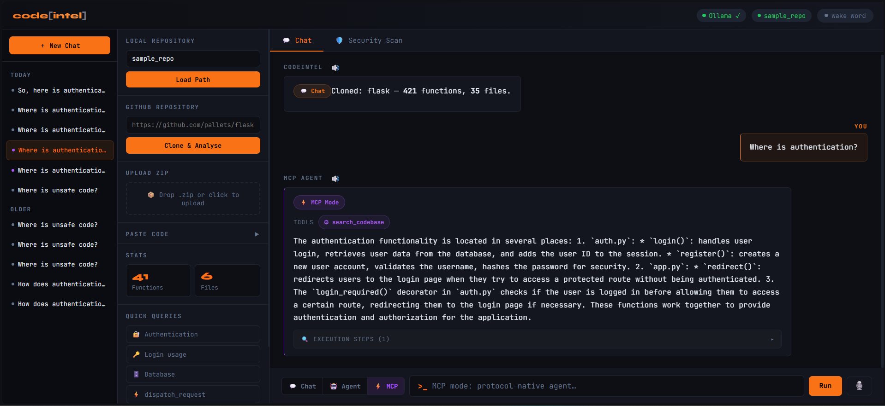

# CodeIntel-RAG — Agentic Codebase Intelligence Platform with MCP

> **Ask questions about any codebase in plain English. Get precise answers, security audits, and dependency graphs — powered by hybrid RAG, a local LLM, a LangGraph ReAct agent, and a full MCP server — all running locally with no data leaving your machine.**

---

## Screenshot




---

## What it does

CodeIntel-RAG is a self-hosted developer tool that turns any Git repository into a searchable, queryable knowledge base. Point it at a codebase, and you can ask things like:

- *"Where is authentication handled?"*
- *"What breaks if I change `dispatch_request()`?"*
- *"Find all hardcoded secrets and injection vulnerabilities."*
- *"Who calls `get_db()` and what does it call in return?"*

The platform combines a **5-signal hybrid retrieval pipeline** with a **LangGraph ReAct agent** and a **full MCP server** that any MCP-compatible client (Cursor, Continue.dev, Open WebUI) can connect to — all running locally with Ollama, with no data leaving your machine.

---

## Project name

**CodeIntel-RAG** *(or: CodeIntel — Agentic Code Intelligence Platform with MCP)*

---

## Demo benchmark — pallets/flask (25 queries)

| Metric | Semantic baseline | Hybrid + Rerank |
|---|---|---|
| Hit@1 | 0.72 | **0.76** |
| Hit@3 | 0.88 | **0.92** |
| Hit@5 | 0.92 | **1.00** ✅ |
| MRR | 0.797 | **0.845** |

Hybrid + Reranking achieves **perfect Hit@5** on all 25 golden queries against the Flask codebase — an **8.7% improvement** over the semantic-only baseline. The semantic baseline scored 0.0 before switching from `microsoft/codebert-base` to `BAAI/bge-base-en-v1.5`.

---

## Architecture

```
┌──────────────────────────────────────────────────────────────────┐
│                        FastAPI backend (api.py)                  │
│                                                                  │
│  /load  /clone  /upload  /chat  /agent-chat  /mcp-chat           │
│  /vulnerabilities  /impact  /graph  /export  /metrics            │
│  /transcribe  /mcp/sse  /mcp/messages                            │
└──────────┬───────────────────────────────────────────────────────┘
           │
    ┌──────▼──────────────────────────────────────────┐
    │               Retrieval Pipeline                │
    │                                                 │
    │  Query ──► 5-signal Hybrid Scorer               │
    │              1. Semantic (FAISS + BGE, w=3)     │
    │              2. BM25 keyword (w=8)              │
    │              3. Structural / call graph (w=10)  │
    │              4. Language / file metadata (w=5)  │
    │              5. Name-token concept match (w=12) │
    │           ──► Cross-encoder reranker            │
    │                 (ms-marco-MiniLM-L-6-v2)        │
    │           ──► Top-K results + cached            │
    └──────┬──────────────────────────────────────────┘
           │
    ┌──────▼──────────────────────────────────────────┐
    │          Three Query Modes                       │
    │                                                  │
    │  💬 Chat  — hybrid retrieval → Ollama answer    │
    │                                                  │
    │  🤖 Agent — LangGraph ReAct agent               │
    │    Tools: search_codebase · scan_security        │
    │           impact_analysis · get_call_graph       │
    │           repo_overview                          │
    │                                                  │
    │  ⚡ MCP   — FastMCP server (in-process SSE)     │
    │    Same 5 tools, MCP protocol                    │
    │    External clients: Cursor · Continue · WebUI   │
    └──────┬──────────────────────────────────────────┘
           │
    ┌──────▼──────────────────────────────────────────┐
    │          Ollama LLM (llama3.2:3b default)        │
    │          Answer generation + streaming SSE       │
    └─────────────────────────────────────────────────┘
```

---

## What's New

### MCP Server (Model Context Protocol)
The platform now ships a **fully spec-compliant MCP server** mounted inside FastAPI at `/mcp`. It exposes all five agent tools over SSE so any MCP-compatible client can connect without a separate process or port.

- **In-process mounting** — tools access live `AppState` directly; zero HTTP overhead
- **External clients supported** out of the box: Cursor IDE, Continue.dev, Open WebUI (via `mcpo`)
- **Standalone mode** (`mcp_server/run_standalone.py`) — run the MCP server separately from FastAPI on port 8001, making API calls back to the main server; useful when you want to attach external clients to an already-running instance
- **Ollama-native agent loop** (`mcp_server/ollama_client.py`) — async ReAct loop that drives any Ollama model through MCP tools with no paid API required; streaming SSE variant included
- **Recommended models for tool-calling**: `qwen2.5:7b` (best), `llama3.1:8b`, `llama3.2:3b` (default, works but less reliable for multi-step)

### Wake Word Detection
Voice activation is now powered by a **MediaRecorder + `/transcribe` two-phase loop** — the same Whisper pipeline used by manual mic input, so transcription quality is consistent regardless of how the query was triggered.

- **Phase 1 (wake)** — records 2.5 s chunks, transcribes, scans for "code intel" (and 40+ known phonetic variants Whisper produces)
- **Phase 2 (query)** — records 4 s after wake confirmation, transcribes, fires the query
- **Same-breath support** — "code intel where is auth?" detected in a single chunk, wake prefix stripped, query fired immediately
- **Hallucination filtering** — common Whisper silence artefacts ("thank you", "bye", "okay", etc.) are swallowed; English forced to prevent Tamil/auto-detect confusion on short clips
- Toggled via the **wake word** button in the top bar; purple pulsing indicator shows active state

### Session Sidebar
Conversations are now persisted in `localStorage` with a full session management UI:

- Auto-saves after every message
- Groups chats by **Today / Yesterday / Older**
- Per-chat mode memory (Chat / Agent / MCP) restored on switch
- Per-chat repo context preserved
- One-click delete with `×` button; **+ New Chat** starts a fresh session

### Security Query Routing
The `/chat` endpoint now includes a keyword-aware security fast-path:

- Queries containing words like `vulnerable`, `injection`, `hardcoded`, `eval`, `exploit`, etc. are intercepted before the LLM
- Findings are filtered by matched keyword category (`injection` → SQL/inject/unsanitized, `secure` → hash/crypto/MD5, etc.)
- File-specific filtering: mentioning `sessions.py` in the query narrows findings to that file
- Retrieval still runs in parallel so source chips, callers, and call graph render normally alongside the security answer

### API hardening (v3)
- `@app.on_event` replaced with `lifespan` context manager (FastAPI best practice)
- API key authentication via `X-API-Key` header on all mutating endpoints (disabled when `API_KEY` is empty)
- Path traversal validation on `/load` — paths must resolve inside `REPO_BASE` or CWD
- Stricter GitHub URL validation on `/clone` — only `https://github.com/<owner>/<repo>` accepted (SSRF prevention)
- `/export` uses Jinja2 templates instead of string interpolation (XSS prevention)
- `get_state()` dependency injection scaffold makes the app testable without a running server

---

## Features

### Retrieval
- **5-signal hybrid scorer** combining semantic embeddings, BM25, call-graph structure, file metadata, and name-token concept matching
- **BAAI/bge-base-en-v1.5** bi-encoder (MTEB top-ranked) for correct NL→Code bridging
- **FAISS IndexFlatIP** for exact cosine search over 768-dim vectors with sliding-window chunking for long functions
- **BM25Okapi** with camelCase/snake_case tokenisation for keyword recall
- **Cross-encoder reranking** (`ms-marco-MiniLM-L-6-v2`) with blended CE + rank-decay scoring (CE_W=0.45, HYBRID_W=0.55)
- **Disk-backed query cache** (MD5 keyed, repo-scoped, configurable TTL) — sub-millisecond repeated queries
- Test-file penalty (×0.12), dunder method penalty (×0.4), generic name penalty (×0.3) to eliminate retrieval noise

### Three Query Modes

| Mode | Trigger | How it works |
|---|---|---|
| 💬 Chat | Default | Hybrid retrieval → Ollama answer, streaming available |
| 🤖 Agent | Agent button | LangGraph ReAct, autonomous multi-tool calls, streaming SSE |
| ⚡ MCP | MCP button | Ollama drives MCP tools via async ReAct loop, streaming SSE |

### MCP Server

Five tools exposed over the MCP protocol:

| Tool | Description |
|---|---|
| `search_codebase` | Hybrid BM25 + semantic retrieval with reranking |
| `scan_security` | Bandit + regex scanner; optional `focus` keyword filter |
| `impact_analysis` | Multi-hop dependency tree up to 3 hops |
| `get_call_graph` | Callers and callees of any function |
| `repo_overview` | Stats, language breakdown, sample functions |

**Connecting external clients:**

```
# Cursor IDE
Settings → MCP → Add server → http://localhost:8000/mcp/sse

# Continue.dev (config.json)
"mcpServers": [{ "name": "codeintel", "url": "http://localhost:8000/mcp/sse" }]

# Standalone MCP server (separate port)
python -m mcp_server.run_standalone
# SSE at http://localhost:8001/sse
```

### Code parsing
- Python AST parser for precise function extraction, call detection, and line numbers
- Generic regex parser for Java, JavaScript, TypeScript, and C++
- Automatic test-file and test-directory exclusion (`skip_tests=True` default)
- Skips files >1 MB, empty files, and non-UTF-8 content gracefully

### Security scanning
- **Bandit** integration for Python (industry standard)
- Regex scanner for Java, JS, TS, C++ detecting: `eval`/`exec`, hardcoded credentials, weak crypto (MD5/SHA-1/DES), SQL injection, XSS, unsafe deserialization, command injection
- **CWE and OWASP Top 10 (2021) mapping** on every finding
- Confidence scoring (HIGH/MEDIUM/LOW) per finding
- Cross-source deduplication (Bandit wins over regex when both fire on the same line)
- Keyword-aware query routing in Chat mode (no LLM needed for security queries)

### Dependency analysis & visualisation
- Multi-hop impact tree (up to 3 hops deep) — *"what breaks if I change X?"*
- Caller/callee graph with risk level (HIGH/MEDIUM/LOW based on affected function count)
- Static PNG call graph (matplotlib/networkx) embedded in the HTML export report
- Interactive Pyvis call graph served via `/graph/interactive` (drag, zoom, hover tooltips)

### Frontend (single-page, no framework)
- Dark terminal-themed UI with JetBrains Mono
- **Session sidebar** — auto-save, chat history persistence (localStorage), per-chat context and mode
- **Three-mode input bar** — Chat / Agent / MCP toggle with distinct colour coding and placeholder text
- **Wake word** — MediaRecorder + Whisper two-phase detection ("code intel …"), topbar toggle with pulsing indicator
- Typewriter streaming animation for bot answers
- Syntax-highlighted code blocks (highlight.js, language auto-detected from file extension)
- Text-to-speech playback on any answer (Web Speech API)
- Voice input via `MediaRecorder` → `/transcribe` (faster-whisper)
- Drag-and-drop `.zip` upload
- Paste code directly in the sidebar (no file needed)
- Security scan tab with severity-grouped findings and one-click HTML report export
- Execution steps panel (collapsible) showing every tool call, input, and observation

### API
- `POST /load` — load a local repository path
- `POST /clone` — clone a GitHub URL (validated, `@` and non-GitHub URLs blocked)
- `POST /upload` — upload a `.zip` archive
- `POST /chat` — RAG chat (non-streaming)
- `GET  /chat/stream` — RAG chat streaming SSE
- `POST /agent-chat` — LangGraph agentic multi-tool Q&A
- `POST /agent-chat/stream` — streaming agentic Q&A
- `GET  /agent/tools` — list available agent tools
- `POST /mcp-chat` — MCP-powered agentic Q&A (non-streaming)
- `POST /mcp-chat/stream` — streaming MCP agentic Q&A
- `GET  /mcp-chat/info` — MCP setup info (Ollama status, endpoints)
- `GET  /mcp/sse` — MCP SSE stream for external clients (Cursor, Continue.dev)
- `POST /mcp/messages` — MCP message endpoint
- `GET  /vulnerabilities` — security scan results
- `POST /impact` — dependency impact tree
- `GET  /graph` — static call graph PNG
- `GET  /graph/interactive` — Pyvis interactive HTML graph
- `GET  /export` — full HTML report (stats + vulnerabilities + function table)
- `GET  /metrics` — query telemetry (total queries, cache hit rate, avg latency)
- `GET  /health` — LLM + repo status

---

## Tech stack

| Layer | Technology |
|---|---|
| Web framework | FastAPI + Uvicorn |
| LLM runtime | Ollama (default: `llama3.2:3b`) |
| Agent framework | LangGraph `create_react_agent` + LangChain |
| MCP server | FastMCP (SSE transport, in-process) |
| MCP client | `mcp` Python SDK + async `sse_client` |
| Embeddings | `BAAI/bge-base-en-v1.5` via sentence-transformers |
| Vector store | FAISS `IndexFlatIP` (CPU) |
| Keyword search | BM25Okapi (`rank-bm25`) |
| Reranker | `cross-encoder/ms-marco-MiniLM-L-6-v2` |
| Security scanner | Bandit + custom regex |
| Graph rendering | NetworkX + Matplotlib (static) · Pyvis (interactive) |
| Voice transcription | faster-whisper |
| Configuration | pydantic-settings + `.env` |
| Containerisation | Docker + Docker Compose |
| Testing | pytest (unit + integration, 15 tests) |

---

## Getting started

### Prerequisites
- [Docker](https://docs.docker.com/get-docker/) and Docker Compose  **or** Python 3.11+
- [Ollama](https://ollama.com/) running locally

```bash
# Pull the default model
ollama pull llama3.2:3b

# For better multi-step tool-calling (recommended for Agent/MCP modes)
ollama pull qwen2.5:7b
```

### Option A — Docker (recommended)

```bash
git clone https://github.com/AdithyaRaoK14/CodeIntel-RAG-Agentic-Code-Intelligence-Platform.git
cd codeintel-rag

docker compose up --build
```

Open **http://localhost:8000** in your browser.

### Option B — Local (Python venv)

```bash
git clone https://github.com/AdithyaRaoK14/CodeIntel-RAG-Agentic-Code-Intelligence-Platform.git
cd codeintel-rag

python -m venv venv
source venv/bin/activate          # Windows: venv\Scripts\activate

# Install CPU-only PyTorch first
pip install torch --index-url https://download.pytorch.org/whl/cpu

pip install -r requirements.txt

uvicorn api:app --reload --host 0.0.0.0 --port 8000
```

Open **http://localhost:8000**.

### Option C — Standalone MCP server (for external clients)

Run this **in addition to** the main FastAPI server when you want Cursor, Continue.dev, or Open WebUI to connect on their own port:

```bash
# Terminal 1 — main API
uvicorn api:app --reload

# Terminal 2 — standalone MCP
python -m mcp_server.run_standalone
# MCP SSE: http://localhost:8001/sse
```

---

## Configuration

All settings are in `config.py` and can be overridden via environment variables or `.env`:

| Variable | Default | Description |
|---|---|---|
| `API_KEY` | `""` | Bearer token for API auth (empty = disabled) |
| `OLLAMA_MODEL` | `llama3.2:3b` | Ollama model name |
| `OLLAMA_HOST` | `http://localhost:11434` | Ollama server URL |
| `TOP_K` | `5` | Final results returned per query |
| `RERANK_CANDIDATES` | `20` | Candidates passed to cross-encoder |
| `CACHE_TTL` | `3600` | Query cache TTL in seconds |
| `MAX_REPO_SIZE_MB` | `500` | Upload size limit |
| `REPO_BASE` | `./repos` | Directory for cloned repos |
| `MCP_SSE_URL` | `http://localhost:8000/mcp/sse` | MCP endpoint (for ollama_client) |
| `MCP_MAX_ITERS` | `6` | Max ReAct iterations in MCP agent loop |
| `OLLAMA_TIMEOUT` | `120` | Ollama request timeout (seconds) |
| `MCP_STANDALONE_PORT` | `8001` | Port for standalone MCP server |
| `CODEINTEL_API_URL` | `http://localhost:8000` | API base URL (standalone MCP mode) |

---

## Running the benchmark

```bash
# Clone Flask into real_repo/
git clone https://github.com/pallets/flask real_repo

# Run benchmark (skips test files by default)
python -m eval.benchmark

# Include test files to see their impact
python -m eval.benchmark --no-skip-tests
```

---

## Running tests

```bash
pytest tests/ test_project.py -v
```

The test suite covers: Python/Java/JS/TS chunkers, dependency analysis, query parsing, BM25 phrase extraction, reranker ranking correctness, query cache (hit/miss/repo-scoped keys), and FastAPI endpoints (health, load, clone URL validation, path traversal blocking, metrics).

---

## Project structure

```
codeintel-rag/
├── api.py                        # FastAPI app — all HTTP endpoints (v3)
├── config.py                     # Centralised settings (pydantic-settings)
│
├── agent/
│   ├── agent_router.py           # /agent-chat + /agent-chat/stream routes
│   ├── agent_runner.py           # LangGraph ReAct agent (run + stream)
│   ├── prompts.py                # Agent system prompt
│   └── tools.py                  # 5 LangChain tools bound to AppState
│
├── mcp_server/
│   ├── server.py                 # FastMCP server (in-process, /mcp/sse)
│   ├── mcp_router.py             # /mcp-chat + /mcp-chat/stream routes
│   ├── ollama_client.py          # Ollama ReAct loop over MCP (async)
│   └── run_standalone.py         # Standalone MCP server (port 8001)
│
├── parser/
│   ├── repo_loader.py            # File walker with test-file filtering
│   ├── code_chunker.py           # Python AST + generic regex chunker
│   └── dependency_analyzer.py   # Caller/callee graph + impact tree
│
├── embeddings/
│   └── vector_store.py           # FAISS store + BGE embeddings
│
├── retrieval/
│   ├── hybrid_retriever.py       # 5-signal hybrid scorer
│   └── reranker.py               # Cross-encoder blended reranker
│
├── cache/
│   └── query_cache.py            # Disk-backed MD5 cache
│
├── services/
│   ├── indexing_service.py       # Repo load → parse → embed → index
│   ├── retrieval_service.py      # hybrid_search → rerank → cache
│   └── graph_service.py          # Call graph PNG + interactive HTML
│
├── generator/
│   └── response_generator.py    # Ollama chat + streaming SSE
│
├── visualization/
│   └── call_graph.py             # NetworkX builder + Matplotlib + Pyvis
│
├── vulnerability_scanner.py      # Bandit + regex + CWE/OWASP mapping
│
├── eval/
│   └── benchmark.py             # 25-query golden set (pallets/flask)
│
├── templates/
│   ├── index.html               # Single-page frontend
│   └── report.html              # Export report template (Jinja2)
│
├── tests/
│   ├── test_api.py              # FastAPI endpoint tests
│   ├── test_project.py          # Unit tests (chunkers, analyzers, cache)
│   └── test_retrieval.py        # Retrieval + reranker tests
│
├── docs/
│   └── screenshot.png           # UI screenshot (add yours here)
│
├── Dockerfile
├── docker-compose.yml
└── requirements.txt
```

---

## How retrieval works

A query goes through five scoring signals combined into a single ranked list before cross-encoder reranking:

1. **Semantic** — BGE embeddings queried against FAISS; handles paraphrase and concept-level matches.
2. **BM25** — tokenises camelCase/snake_case function names; exact and fuzzy keyword recall.
3. **Structural** — for usage queries (*"what calls X?"*), the call graph is traversed to surface callers directly; for definition queries, callees are boosted.
4. **Language/metadata** — language keywords in the query (e.g. *"Python functions"*) boost chunks from matching file extensions.
5. **Name-token concept matching** — query content words (with synonym expansion) are matched against decomposed function name tokens. Generic names (`response`, `request`, `app`) are penalised to prevent false wins.

Test-file chunks are penalised ×0.12, dunder methods ×0.40, and generic names ×0.30. The top 20 candidates are passed to the cross-encoder, which produces a blended score (CE 45% + positional rank decay 55%).

---

## Security & safety

- GitHub-only clone validation (non-GitHub URLs and URLs containing `@` are blocked with HTTP 400)
- Path traversal protection on `/load` (paths must resolve inside `REPO_BASE`)
- Optional API key authentication via `X-API-Key` header
- File upload size capped at `MAX_REPO_SIZE_MB` (default 500 MB)
- `.git`, `__pycache__`, `node_modules`, `venv`, and other build directories are always skipped during indexing
- `/export` uses Jinja2 templates to prevent XSS in the HTML report
- `lifespan` context manager handles startup/shutdown cleanly (no deprecated `@app.on_event`)

---

## Acknowledgements

- [pallets/flask](https://github.com/pallets/flask) — used as the benchmark repository
- [BAAI/bge-base-en-v1.5](https://huggingface.co/BAAI/bge-base-en-v1.5) — retrieval-trained bi-encoder
- [cross-encoder/ms-marco-MiniLM-L-6-v2](https://huggingface.co/cross-encoder/ms-marco-MiniLM-L-6-v2) — cross-encoder reranker
- [Ollama](https://ollama.com/) — local LLM runtime
- [LangGraph](https://github.com/langchain-ai/langgraph) — agent framework
- [FastMCP](https://github.com/jlowin/fastmcp) — MCP server framework
- [MCP Python SDK](https://github.com/modelcontextprotocol/python-sdk) — MCP client for Ollama agent loop
- [Bandit](https://bandit.readthedocs.io/) — Python security scanner

---

## License

MIT
